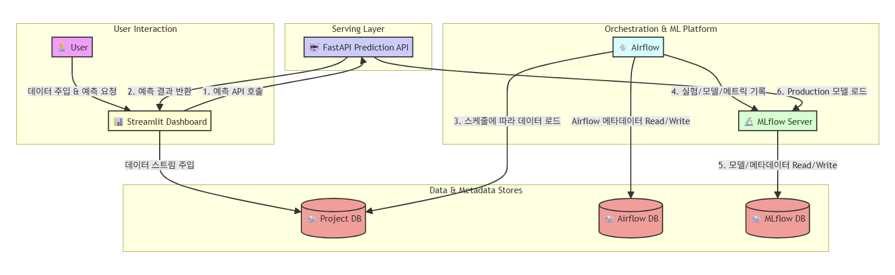

# E2E Sales Forecasting MLOps Project

이 프로젝트는 주간 판매량을 예측하는 머신러닝 모델을 위한 End-to-End MLOps 파이프라인을 구축합니다. Airflow, MLflow, FastAPI, Streamlit 등 여러 오픈소스를 Docker Compose로 통합하여 데이터 파이프라인, 모델 학습, 서빙, 모니터링의 전 과정을 자동화합니다.

## 🏗️ 시스템 아키텍처



## 🌟 주요 기능

- **워크플로우 오케스트레이션**: Apache Airflow를 사용하여 매일 자동으로 모델을 재학습하는 DAG(Directed Acyclic Graph)를 실행합니다.
- **실험 추적 및 모델 관리**: MLflow를 통해 모델 학습 과정(파라미터, 메트릭)을 기록하고, 학습된 모델을 버전 관리하며 Production 모델을 관리합니다.
- **실시간 모델 서빙**: FastAPI를 사용하여 MLflow 레지스트리의 Production 모델을 REST API로 제공합니다.
- **인터랙티브 대시보드**: Streamlit으로 구축된 대시보드를 통해 시스템 현황, 모델 성능, 학습 로그를 모니터링하고, 실시간으로 예측을 테스트할 수 있습니다.
- **데이터 스트림 시뮬레이션**: Streamlit 대시보드에서 새로운 데이터를 주입하여 파이프라인 전체가 새로운 데이터에 어떻게 반응하는지 시뮬레이션할 수 있습니다.

## 📂 프로젝트 구조

```
e2e-sales/
├── dags/                 # Airflow DAG 정의 (training_and_production.py)
├── data/                 # 초기 데이터 (raw) 및 처리된 데이터 (merged)
├── serving_api/          # 모델 서빙을 위한 FastAPI 애플리케이션
├── streamlit_app/        # 모니터링을 위한 Streamlit 대시보드
├── sql/                  # DB 초기화를 위한 SQL 스크립트
├── docker-compose.yaml   # 전체 서비스 오케스트레이션을 위한 Docker Compose 파일
├── Dockerfile.*          # 각 서비스 빌드를 위한 Dockerfile
└── .env.example          # 환경변수 설정을 위한 템플릿 파일
```

## 🚀 시작하기

### 사전 요구사항

- [Docker](https://www.docker.com/get-started)
- [Docker Compose](https://docs.docker.com/compose/install/)

### 설치 및 실행

1.  **저장소 복제**
    ```bash
    git clone <repository-url>
    cd e2e-sales
    ```

2.  **환경변수 설정**
    `.env.example` 파일을 복사하여 `.env` 파일을 생성합니다. 필요시 내부 변수를 수정합니다.
    ```bash
    cp .env.example .env
    ```
    > **Linux/macOS 사용자**: `id -u` 명령을 실행하여 나온 숫자로 `.env` 파일의 `AIRFLOW_UID` 값을 변경하면 파일 권한 문제를 예방할 수 있습니다.

3.  **Docker 컨테이너 실행**
    다음 명령어를 사용하여 모든 서비스를 빌드하고 백그라운드에서 실행합니다.
    ```bash
    docker-compose up --build -d
    ```

## 🛠️ 사용 방법

서비스가 모두 실행되면 다음 URL을 통해 각 컴포넌트에 접근할 수 있습니다.

- **📊 Streamlit 대시보드**: `http://localhost:8501`
  - 시스템의 전체 현황을 모니터링하고, 데이터 주입을 시뮬레이션하며, 모델 예측을 테스트할 수 있는 메인 인터페이스입니다.
- **💨 Airflow UI**: `http://localhost:8080`
  - 사용자: `airflow`, 비밀번호: `airflow`
  - `daily_train_sales` DAG의 실행 상태를 확인하고 수동으로 트리거할 수 있습니다.
- **🔬 MLflow UI**: `http://localhost:5000`
  - `sales_daily` 실험의 모든 실행 기록, 파라미터, 메트릭을 확인하고 모델 레지스트리에서 모델의 단계를 관리할 수 있습니다.
- **🤖 FastAPI (API 문서)**: `http://localhost:8000/docs`
  - 서빙되고 있는 모델의 API 문서를 확인하고 직접 API를 호출해볼 수 있습니다.

### 워크플로우 시뮬레이션

1.  **Streamlit 대시보드**(`http://localhost:8501`)에 접속합니다.
2.  사이드바의 **"▶️ 다음 1주일 데이터 주입"** 버튼을 클릭하여 새로운 데이터를 DB에 추가합니다.
3.  **Airflow UI**(`http://localhost:8080`)에서 `daily_train_sales` DAG를 수동으로 트리거합니다.
4.  DAG가 실행되면서 새로운 데이터로 모델을 학습하고, 성능을 검증한 뒤, 더 나은 모델일 경우 **MLflow**의 Production 단계로 승격시킵니다.
5.  FastAPI 서버는 새로운 Production 모델을 자동으로 로드합니다.
6.  다시 **Streamlit 대시보드**의 '모델 예측 테스트' 탭에서 방금 주입한 데이터로 예측을 수행하여 실제값과 비교해볼 수 있습니다.